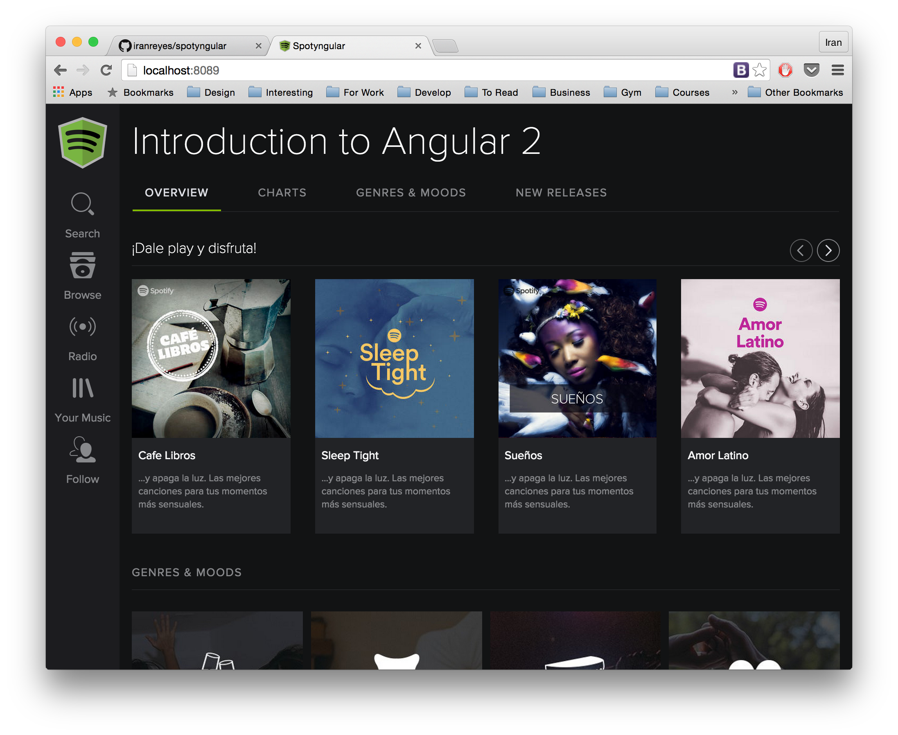

# Overview - Spotyngular Workshop

Clone of Spotify using Angular 2. The application was entire written using components and present a posible frontend architecture for future projects.

It's another demo to check and learn how many pieces of angularjs 2 features interact together.

We will use `angular-cli` to go through the workshop



## Requirements

### 1 - Node

Require `Node 4` or greater. You can download it from [https://nodejs.org](https://nodejs.org)

### 2 - Angular cli

Install the `angular-cli` using `npm`:

`npm install -g angular-cli`

You can learn how to use `angular-cli` here [https://github.com/angular/angular-cli](https://github.com/angular/angular-cli)

## Create Project

When you install `angular-cli` you will have a new command in your terminal called `ng`, let's create a new angular 2 application with `ng new spotyngular`.

Once that is created the application enter to the folder `spotyngular` and run the server with `ng serve`.

To summarize you should do:

```
$ ng new spotyngular
$ cd spotyngular
$ ng serve
```

## Setting up the bases

All the data that you will need for this workshop in order to do it quickly is located inside the folder `data` in the root of the project.

### 1 - Copy assets to `src` folder

Copy the assets to the project

```
$ copy data/vendors.css src/vendor.css
$ copy data/spotyngular.css src/app/spotyngular.css
$ copy data/spotyngular.html src/app/spotyngular.html
$ copy data/images src/images/
```

### 2 - Link `vendor.css`

Include `vendor.css` in `src/index.html` file

```HTML
<link rel="stylesheet" type="text/css" href="vendor.css">
```

### 3 - Reference to component's CSS file

Tell `spotyngular` component to load it's CSS file. This is done by passing the `styleUrls ` parameter to the component definition.

```
@Component({
...
styleUrls: ['app/spotyngular.css'],
...
})
```

### 4 - Result

We will have in the component `spotyngular` all the `html` of the demo site.

## Fetch albums from an external service

We're going to simulate an external HTTP API so we're going to fetch albums.

### 1 - Copy dummy json file

Copy the `albums.json` to `src` folder.

```
$ cp sources/albums.json spotyngular/src/
```

### 2 - Register http dependency

We need to do register the HTTP module so it can be injected in our app. So in the `app.js` file that is our root component write:

```
import {bootstrap} from 'angular2/platform/browser';
import {SpotyngularApp} from './app/spotyngular';
import {ROUTER_PROVIDERS} from 'angular2/router';
import {HTTP_PROVIDERS} from 'angular2/http';

bootstrap(SpotyngularApp, [
  ROUTER_PROVIDERS,
  HTTP_PROVIDERS
]);
```

### 3 - Load the list of albums

New template syntax

* Using `*` to prefix directives e.g. `*ng-for`
* Using `[...]` to bind attributes
* Using `(...)` to bind events
* Using `[(...)]` to do two-way bindings
* Using `#` to create local template variables

Note that in the case of events, you can use `^` sign as prefix to tell Angular to bubble the event up the component tree.

-----

Let's read the list of albums from the context and iterate using the `ngFor` directive. Let's create it in two steps, first load the list of albums from an `array` and then from a `json` file using the `http` service.

Change the template to generate the list of album covers

`src/app/spotyngular.html`

```
<div *ngFor="#album of albums">
  <div class="col-sm-3 col-md-3 col-lg-2 media default image-grid genre">
    <a>
      <div class="genreImage" [style.background-image]="'url('+album.image+')'"></div>
    </a>
  </div>
</div>
```

And on the JavaScript side return the list of albums

`src/app/spotyngular.ts`

```JS
import {NgFor} from 'angular2/common';
...
@Component({
  ...
  directives: [ROUTER_DIRECTIVES, NgFor],
  ...
})
...
export class SpotyngularApp {
  ...
  albums: Array<any>;

  constructor(private http: Http){
    http
      .get('/albums.json')
      .subscribe(response => this.albums = response.json()['albums']);
  }
  ...
}
```

## Components

Let's create a component that represents one album cover.

```
$ ng generate component album-cover

installing component
  create src/app/components/album-cover/album-cover.css
  create src/app/components/album-cover/album-cover.html
  create src/app/components/album-cover/album-cover.ts
installing component-test
  create src/app/components/album-cover/album-cover.spec.ts
```

We have to move the HTML of the album cover to `src/app/components/album-cover/album-cover.html`.

```
<div class="col-sm-3 col-md-3 col-lg-2 media default image-grid genre">
  <a>
    <div class="genreImage" [style.background-image]="'url('+album.image+')'"></div>
  </a>
</div>
```

and on the JavaScript side of the component we have to register the properties we want to use.

```
@Component({
  selector: 'album-cover',
  ...
  properties: ['album']
})
export class AlbumCover {
  constructor() {}
}
```

Then we have to move the styles to the corresponding component css file. This is because the styles are encapsulated for each component, so they won't be applied unless they are defined on a global css file on the right component.

```
.genres-section{
    margin-bottom: 0px;
    padding-top: 20px;
}

.media {
    margin-top: 15px !important;
    padding-right: 5px !important;
}

.media.genre .genreImage {
    padding-bottom: 100%;
    background-size: contain;
    background-repeat: no-repeat;
}

.media.genre .name {
    position: absolute;
    top: 72%;
    left: 5%;
    right: 5%;
    bottom: 0;
    text-align: center;
}

.media.genre .name span {
    color: #DFE0E6;
    font-size: 16px;
    line-height: 20px;
    font-weight: 400;
    border-bottom: 1px solid transparent;
}
```

Once we created the new component we can use it from the main component.

```
<div class="row fivecolumns">
  <album-cover *ngFor="#album of albums" [album]="album"></album-cover>
</div>
```

and on the JavaScript side we have to register the component

```
import {AlbumCover} from './components/album-cover/album-cover';

@Component({
  selector: 'music-app',
  ...
  directives: [NgFor,AlbumCover],
  ...
})
```

### 1 - Handle click event

To handle click event you have to use the `(click)="handler()"` syntax.

```
<div class="col-sm-3 col-md-3 col-lg-2 media default image-grid genre">
  <a>
    <div class="genreImage" [style.background-image]="'url('+album.image+')'" (click)="open()"></div>
  </a>
</div>
```

and you need to declare the function open in order to use it.

```
...
export class AlbumCover {
  album: any;

  constructor() {}

  open() {
    alert("You selected " + this.album.artist + " - " + this.album.album);
  }
}
```

## Routes

Let's see how to use the routing facilities Angular 2.0 brings

### 1 - Create the albums-page component

Generate the component and move everything to that component.

```
$ ng generate component albums-page
version: 1.13.8
installing component
  create src/app/components/albums-page/albums-page.css
  create src/app/components/albums-page/albums-page.html
  create src/app/components/albums-page/albums-page.ts
installing component-test
  create src/app/components/albums-page/albums-page.spec.ts
```

src/app/components/albums-page/albums-page.ts

```
import {NgFor} from 'angular2/common';
import {Component} from 'angular2/core';
import {Http} from 'angular2/http';
import {AlbumCover} from '../album-cover/album-cover';


@Component({
  selector: 'albums-page',
  templateUrl: 'app/components/albums-page/albums-page.html',
  styleUrls: ['app/components/albums-page/albums-page.css'],
  providers: [],
  directives: [NgFor, AlbumCover],
  pipes: []
})
export class AlbumsPage {
  albums: Array<any>;

  constructor(private http: Http) {
    http
      .get('/albums.json')
      .subscribe(response => this.albums = response.json()['albums']);
  }

}
```

src/app/components/albums-page/albums-page.html

```
<div class="section-divider genres-section">
  <div id="featuredPlaylistLabel">
    Albums
  </div>
</div>
<div id="genresAndMoods">
  <div class="row fivecolumns">
    <album-cover *ngFor="#album of albums" [album]="album"></album-cover>
  </div>
</div>
```

```
.genres-section{
    margin-bottom: 0px;
    padding-top: 20px;
}
```

And update src/app/spotyngular.ts and src/app/spotyngular.html accordingly

```
...
<albums-page></albums-page>
...
```

## 2 - Create root route /

First we register the root route and indicate that it should load the AlbumsPage component.

src/app/spotyngular.ts

```
...
@RouteConfig([
    {
      path: "/",
      as: "Albums",
      component: AlbumsPage
    }
])
...
```

And then we indicate where do we want to render the components in the template using the `<router-outlet>` directive.

```
<router-outlet></router-outlet>
```

and that's it. If we reload the page, the root path it's going to be load.

### 3 - Adding a child route

First, let's add another page (component).

```
$ ng generate component tracks-page
```

and copy the template and CSS.

Then register the route and make the click on the album covers to navigate to this route.

src/app/components/album-cover/album-cover.ts

```
...
import {Router} from 'angular2/router';

...
export class AlbumCover {
  album: any;

  constructor(private router:Router) {}

  open() {
    this.router.navigate(['Tracks']);
  }
}
```

## The end for now
